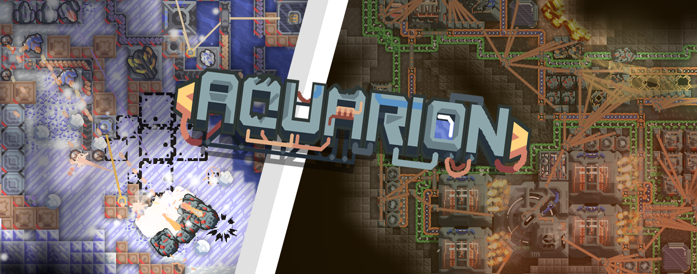

  
  
  
  

  

---

An ambitious attempt to recreate **Tantros** in Mindustry, added a new solar system.
## 💡 Features

* **🪐 A completely new solar system**
---

## ⚠️ Important Notes

> [!IMPORTANT]
> To ensure the best experience and avoid breaking your game, please keep the following in mind:

* **Mod Conflicts:** The mod adds new blocks, units, and a completely different solar system, so there may be conflicts with other mods.
* **Frequent Updates:** Updates are frequent but mostly small. **Remember to reinstall or update the mod regularly** to ensure all new content and fixes load properly.
* **Work in Progress:** This mod is still heavily under development. If you encounter any bugs, balance issues, or crashes, please report them via [GitHub Issues](https://github.com/Twcash/Aquarion/issues).

---

## 🛠️ Installation & Contribution

### How to Install
1. In Mindustry, go to **Mods** -> **Browse Mods**.
2. Search for `Aquarion` and click **Install**.
3. Restart your game and enjoy the depths!

### Contributing
We welcome community contributions! Whether you want to help with code, sprites, or translations, please read our [CONTRIBUTING.md](https://github.com/Twcash/Aquarion/blob/main/CONTRIBUTING.md) guide before submitting a Pull Request.

---

## 👥 Credits

* **[Twcash](https://github.com/Twcash)** — Lead Developer, Coding & Core Concept.
---

## 📈 Star History

