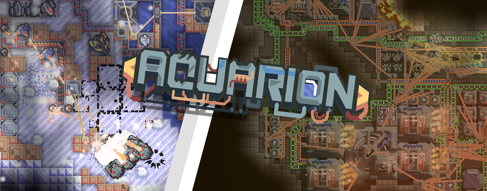
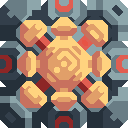

  

  
  
  
  

  
  

---

Este mod inició como un ambicioso intento de recrear **Tantros** en Mindustry, escaló a añadir un nuevo sistema solar y recrear Serpulo. Erekir esta planeado para ser integrado en el futuro.
##  Adiciones

* **Un nuevo sistema solar completo**
  * Tantros con un enemigo único
  * Serpulo con un árbol de tecnología completamente nuevo 
  * árbol de tecnología compartido entre todos los planetas

---

##  Información

> [!IMPORTANTE]
> Para tener la mejor experiencia y evitar romper tu juego, porfavor mantener lo siguiente en mente:

* **Conflictos con Mods:** El mod añade bloques, objetos, unidades y un sistema solar completo esto puede generar conflictos con otros mods.
* ~~**Actualizaciones Frecuentes:** Actualizaciones son frecuentes pero pequeñas. **Recuerda reinstalar o actualizar el mod regularmente** para asegurar que nuevo contenido y arreglos de errores carguen correctamente.~~
  * (eso es una mentira, actualizaciones son infrecuentes i pueden contener todo desde un solo arreglo de errores a un planeta completamente nuevo)
* **Trabajó en Proceso:** Este mod esta todavía en desarrollo temprano. si encuentras cualquier error, problemas de balance, crasheos o simplemente errores ortográficos, porfavor reportalos via [GitHub Issues](https://github.com/Twcash/Aquarion/issues) o en el [Discord](https://discord.gg/SbFhxYD797).
  * también eres bienvenido a intentar arreglarlo tu mismo y hacer una PR para eso

---

##  Instalación & Contribución

### Como instalarl
1. Atravez del navegador de mods del juego
   1. En Mindustry, ve a **Mods** -> **Navegar Mods**
   2. Busca `Aquarion` i preciona **Instalar** 
   3. Reinicia el juego
2. Atravez de Releases de Github 
   1. En Github, preciona el texto de **Releases** 
   2. Preciona la mas alta (o cualquier versión que quieras, realmente) 
   3. Descarga el Aquarion.jar

### Contribuir
Nos encanta recibir contribuciones de la comunidad! Por si quieres ayudar con código, texturas, o traducciones, porfavor lee nuestra [CONTRIBUTING.md](https://github.com/Twcash/Aquarion/blob/main/CONTRIBUTING.md) guia antes de crear una Pull Request

---

## Historial de Estrellas

<a href="https://www.star-history.com/?repos=Twcash%2FAquarion&type=date&legend=top-left">
 <picture>
   <source media="(prefers-color-scheme: dark)" srcset="https://api.star-history.com/chart?repos=Twcash/Aquarion&type=date&theme=dark&legend=top-left&sealed_token=VObfnvkKCiuYbRHoX9JPRX49-ggXuhVsgt-f2LUmsW34Sc0nmpCqyrzQO863qBgeaS88RaTiATjPCUpqp4AIAuuXEkOsZbCrHRhEBJ6FQUd5_92KOPwsnQ" />
   <source media="(prefers-color-scheme: light)" srcset="https://api.star-history.com/chart?repos=Twcash/Aquarion&type=date&legend=top-left&sealed_token=VObfnvkKCiuYbRHoX9JPRX49-ggXuhVsgt-f2LUmsW34Sc0nmpCqyrzQO863qBgeaS88RaTiATjPCUpqp4AIAuuXEkOsZbCrHRhEBJ6FQUd5_92KOPwsnQ" />
   
 </picture>
</a>
