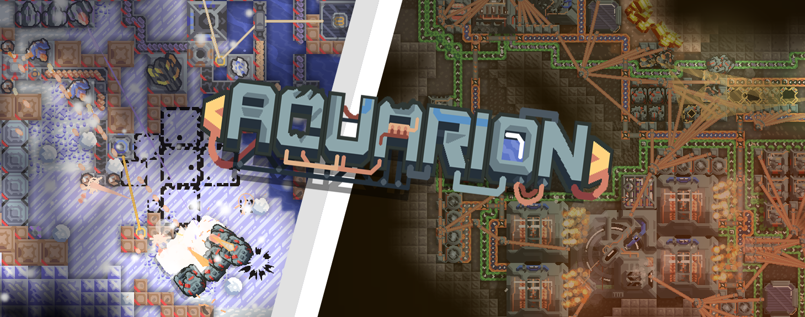
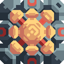

  

  
  
  
  

  
  

---

Этот мод начался как амбициозная попытка воссоздать **Тантрос** в Mindustry, а перерос в добавление новой звездной системы и переработку Серпуло. Интеграция Эрекира планируется позже.

##  Особенности

* **Совершенно новая звездная система**
  * Тантрос с уникальным врагом
  * Серпуло с совершенно новым древом технологий игрока
  * Общее древо технологий для всех планет

---

##  Информация

> [!IMPORTANT]
> Чтобы обеспечить наилучшие впечатления и избежать поломки игры, пожалуйста, имейте в виду следующее:

* **Конфликты модов:** Мод добавляет новые блоки, юниты и совершенно другую звездную систему, поэтому возможны конфликты с другими модами.
* ~~**Частые обновления:** Обновления выходят часто, но они в основном небольшие. **Не забывайте регулярно переустанавливать или обновлять мод**, чтобы весь новый контент и исправления загружались корректно.~~
  * (это ложь: обновления выходят редко и могут содержать что угодно — от единичного исправления ошибки до целой новой планеты)
* **В разработке:** Этот мод все еще находится в стадии активной разработки. Если вы столкнетесь с какими-либо багами, проблемами с балансом, вылетами или просто опечатками, пожалуйста, сообщите о них через [GitHub Issues](https://github.com/Twcash/Aquarion/issues) или в нашем [Discord](https://discord.gg/SbFhxYD797).
  * вы также можете попробовать исправить эти проблемы самостоятельно и отправить PR (Pull Request)

---

##  Установка и участие в разработке

### Как установить
1. Через внутриигровой браузер модов:
   1. В Mindustry перейдите в **Моды** -> **Просмотр модов**
   2. Найдите `Aquarion` и нажмите **Установить**
   3. Перезапустите игру
2. Через релизы GitHub:
   1. На странице GitHub нажмите на текст **Releases**
   2. Нажмите на самый верхний релиз (или на любую нужную вам версию)
   3. Скачайте файл Aquarion.jar

### Участие в разработке
Мы приветствуем вклад сообщества! Если вы хотите помочь с кодом, спрайтами или переводами, пожалуйста, ознакомьтесь с нашим руководством [CONTRIBUTING.md](https://github.com/Twcash/Aquarion/blob/main/CONTRIBUTING.md) перед отправкой Pull Request.

---

## История звёзд (Star History)

<a href="https://www.star-history.com/?repos=Twcash%2FAquarion&type=date&legend=top-left">
 <picture>
   <source media="(prefers-color-scheme: dark)" srcset="https://api.star-history.com/chart?repos=Twcash/Aquarion&type=date&theme=dark&legend=top-left&sealed_token=VObfnvkKCiuYbRHoX9JPRX49-ggXuhVsgt-f2LUmsW34Sc0nmpCqyrzQO863qBgeaS88RaTiATjPCUpqp4AIAuuXEkOsZbCrHRhEBJ6FQUd5_92KOPwsnQ" />
   <source media="(prefers-color-scheme: light)" srcset="https://api.star-history.com/chart?repos=Twcash/Aquarion&type=date&legend=top-left&sealed_token=VObfnvkKCiuYbRHoX9JPRX49-ggXuhVsgt-f2LUmsW34Sc0nmpCqyrzQO863qBgeaS88RaTiATjPCUpqp4AIAuuXEkOsZbCrHRhEBJ6FQUd5_92KOPwsnQ" />
   
 </picture>
</a>
